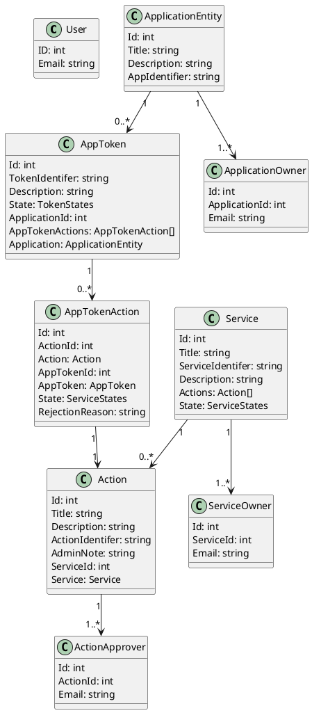

# Domain

```plantuml

@startuml
class User
{
  ID: int
  Email: string
}

class Service
{
  Id: int
  Title: string
  ServiceIdentifer: string
  Description: string
  Actions: Action[]
  State: ServiceStates
}

class Action
{
  Id: int
  Title: string
  Description: string
  ActionIdentifer: string
  AdminNote: string
  ServiceId: int
  Service: Service
}

class ApplicationEntity
{
  Id: int
  Title: string
  Description: string
  AppIdentifier: string
}
class AppToken
{
  Id: int
  TokenIdentifer: string
  Description: string
  State: TokenStates
  ApplicationId: int
  AppTokenActions: AppTokenAction[]
  Application: ApplicationEntity
}
class AppTokenAction
{
  Id: int
  ActionId: int
  Action: Action
  AppTokenId: int
  AppToken: AppToken
  State: ServiceStates
  RejectionReason: string
}

class ActionApprover
{
  Id: int
  ActionId: int
  Email: string
}
class ApplicationOwner
{
  Id: int
  ApplicationId: int
  Email: string
}
class ServiceOwner
{
  Id: int
  ServiceId: int
  Email: string
}
ApplicationEntity "1"-->"0..*" AppToken
AppToken "1"-->"0..*" AppTokenAction
Service "1"-->"0..*" Action
AppTokenAction "1" --> "1" Action
Action "1" --> "1..*" ActionApprover
Service "1" --> "1..*" ServiceOwner
ApplicationEntity "1" --> "1..*" ApplicationOwner
@enduml
```
