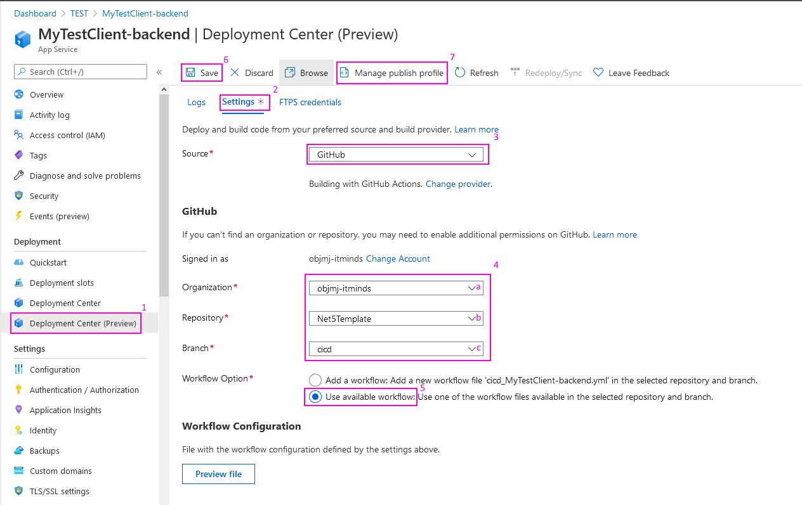
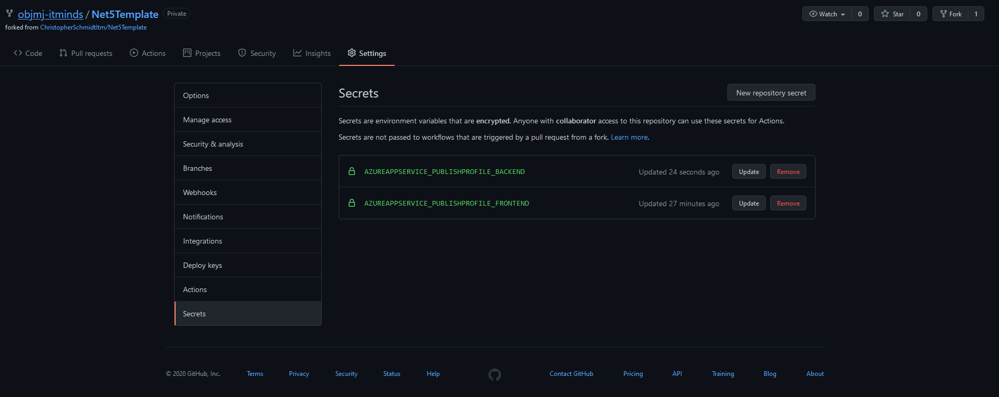

# Infrastructure as Code

ARM template and guide for setting up the infrastructure of this system for Azure.

## How it works.

The following directory contains the ARM (Azure Resource Manager) template for our standard web app setup.

- 1 Database server with 1 database
- 1 Windows Server
- 1 Backend Web App
- 1 Frontend Web App.

Using Azure's "Deploy custom template" option the entire default infrastructure can be set up in one click.
The template can take parameters that customize the resources.

### Parameters

- appName:
  App Name is for the unique name of the application. Following the naming convention of the resource group
  `Client_XXX_YYY` the App Name should be the `YYY` as the name of the project.
- department:
  Enum selector or the department where this project is made and ultimately has financial responsibility for.
- techLead:
  Tech Lead is the Senior Developer who has answers for the tech usage of all resources.
- followupDate:
  A date in the future where this project is forecasted to have been closed and therefor when quarterly
  Azure cleanups happen should be checked with Tech Lead.

### Post tasks

This IAC isn't perfect, and to avoid spending too much time automating the entire process, some tasks need to be done manually.

#### CD pipelines setup

Go into each of the web apps and follow this setup.

1. Go to Deployment Center.
2. Go to Settings, don't wait for logs to load there won't be any.
3. Select GitHub as the source.
4. Fill out the form:
   - **a** Organization should always be IT Minds
   - **b** Repository should point to where the application is located.
   - **c** Branch should in most cases be `feature/cicd` wherein you can edit the pipeline before release.
5. Select the option to use an available workflow.
6. Finally click save.
7. Download the publish profile and head over to GitHub and create the corresponding secret
   - `AzureAppService_PublishProfile_Backend`
   - `AzureAppService_PublishProfile_Frontend`

Finally you should add the same `appName` as in [Parameters](###Parameters) to GitHub's secrets as
`AzureAppService_AppName`

#### Database Firewall

This section has yet to be completed.

<!-- ! this is disables unless source is public -->

<!-- ### Quick deploy

Clicking this button will put you straight into the deployment flow of the IAC. -->

<!--  -->
